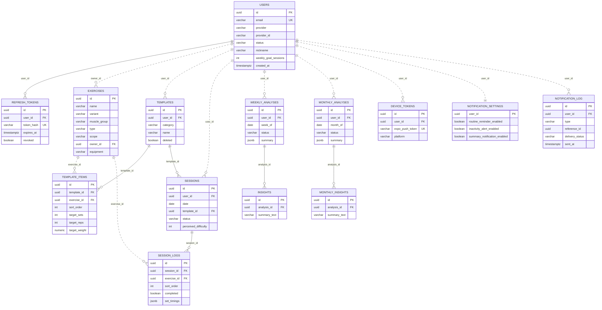

# DB 스키마 (ERD)

Flyway 마이그레이션(V1~V22) 기준 전체 13개 테이블. GitHub에서 mermaid 블록이 자동 렌더링된다.

- **실선** — DB에 실제 `FOREIGN KEY` 제약이 있는 관계
- **점선** — 코드에서만 참조하고 DB 제약은 없는 관계 (대부분의 `user_id`/`exercise_id` 참조가 여기 해당 — 2026-09-24, `exercises`에서 PERSONAL 종목을 직접 삭제했을 때 `session_logs`/`template_items`에 고아 `exercise_id` 참조가 남은 게 이 구조 때문)

## 도메인별 구성

| 도메인 | 테이블 |
|---|---|
| 인증 | `users`, `refresh_tokens` |
| 운동 카탈로그 | `exercises` (GLOBAL/PERSONAL) |
| 루틴·세션 기록 | `templates`, `template_items`, `sessions`, `session_logs` |
| 분석 | `weekly_analyses`/`insights`, `monthly_analyses`/`monthly_insights` |
| 알림 | `device_tokens`, `notification_settings`, `notification_log` |
